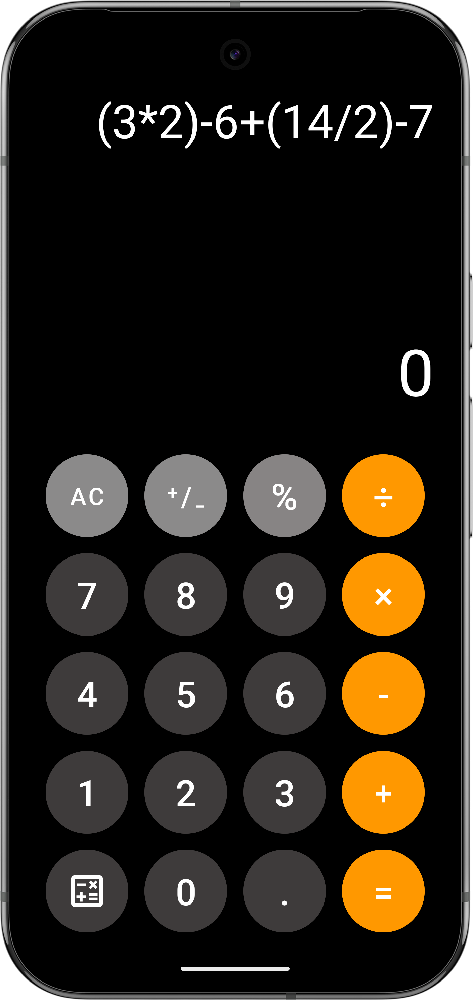

# iOS Calculator UI Clone (Android XML)

Pixel-inspired calculator interface recreated in Android XML using Material Components. This repo focuses on layout and styling only (no calculator logic). Built as part of my university mobile development course.

## STAR Project Story
**Situation:** I needed a clean, mobile-ready UI replica of the iOS calculator to demonstrate layout precision and visual polish in Android.  
**Task:** Build a faithful, reusable calculator screen layout using only XML resources.  
**Action:** Designed the hierarchy in `RelativeLayout` + `LinearLayout`, styled buttons with Material Components, and centralized the color palette in `colors.xml`.  
**Result:** A consistent, pixel-inspired calculator UI that mirrors iOS spacing, sizing, and visual hierarchy.

## Preview



## Features
- iOS-inspired calculator layout
- Material buttons with rounded corners and color theming
- Centralized color palette for quick theming
- UI-only implementation (ideal for design exercises or starting points)

## Tech Stack
- Android XML layouts
- Material Components for Android

## Getting Started
1. Create or open an Android Studio project.
2. Copy `activity_main.xml` into `app/src/main/res/layout/`.
3. Copy `colors.xml` into `app/src/main/res/values/`.
4. Ensure Material Components is enabled in your app theme.

## Project Structure
```
.
├── activity_main.xml
├── colors.xml
├── Screenshot 2024-10-30 200225.png
└── Screenshot_20241030_191836.png
```

## Customization
- Update colors in `colors.xml` to re-theme the UI.
- Adjust button size, margin, and radius in `activity_main.xml` for different device densities.

## License
No license specified yet.
